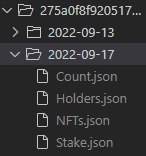
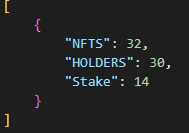
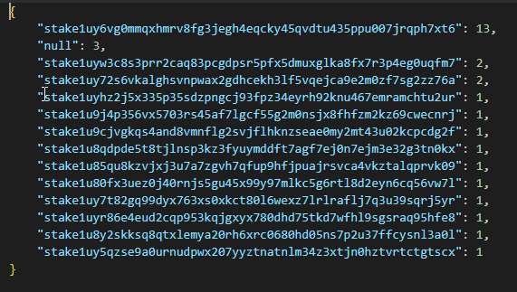

# CNFT Scraper

#### Description:

Simple script to gather/scrape data about a CNFT project by it's policy ID using the Blockfrost.io API. The data get's saved in a folder seperate by policy and day, meant kinda a daily scraper. For it to function the Blockfrost.io API key must be set in .env and the policy ID passed as a argument when executing the script.

**Using the script**
```py
Download the script/repo
cd CNFT-Scraper/
pip3 install -r requirements.txt
#Edit info in .env
python project.py 275a0f8f92051704572a0de654ca3ab50530c9fc2b61dac2a3fa7384
#Wait till it finishes
#Data should be created in folder 275a0f8f92051704572a0de654ca3ab50530c9fc2b61dac2a3fa7384
```

**Examples**
Folder structure

Count.json which contains basic stats about item count

Stake.json which contains info about the holders by stake address
